# Data Visualisation Dashboards Portfolio (Tableau • Looker Studio • Cognos • Excel)

A curated set of dashboard builds showcasing **KPI tracking**, **business-style reporting**, and **data storytelling** across multiple BI tools.  
Each section contains exported dashboard images for quick viewing, plus supporting documentation within the tool folders.

---

## Contents
- [What this repo contains](#what-this-repo-contains)
- [Dashboard Themes](#dashboard-themes)
- [Tool Stack](#tool-stack)
- [How to navigate](#how-to-navigate)
- [Dashboards](#dashboards)
  - [Tableau](#tableau)
  - [Looker Studio](#looker-studio)
  - [IBM Cognos Analytics](#ibm-cognos-analytics)
  - [Excel Dashboards](#excel-dashboards)
- [Notes](#notes)

---

## What this repo contains
This repository contains:
- **Dashboard exports** (PNG/JPEG) for fast preview and portfolio browsing
- **Multi-tool coverage** showing how similar reporting goals are implemented across different platforms
- **Common dashboard building skills**: layout design, KPI summarisation, comparisons, segmentation, time trends, and storytelling

---

## Dashboard Themes
Across the dashboards, you’ll see patterns commonly used in analytics work:
- **Executive KPI summaries** (headline totals, averages, top performers)
- **Trend analysis** (time series, year-over-year comparisons)
- **Category comparisons** (models, groups, segments)
- **Contribution analysis** (dealer-level breakdowns, product-line performance)
- **Service/quality insights** (recalls, systems affected, sentiment breakdowns)

---

## Tool Stack
- **Tableau**
- **Looker Studio**
- **IBM Cognos Analytics**
- **Microsoft Excel**

---

## How to navigate
- Start from the **Dashboards** section below for a quick preview.
- For deeper context (metrics used, layout logic, and interpretation), open each tool folder inside `assets/`.

> Tip: All dashboard images below are placed inside collapsible sections for cleaner browsing.

---

# Dashboards

## Tableau

  
<strong>King Crab Population (2018–2019) — Group differences and growth patterns</strong>

**What this dashboard demonstrates**
- Relationship analysis (**scatter plot + trend line**) to show association patterns
- Group comparisons (**bar charts**) to highlight differences across categories
- Year-over-year movement (**trend line**) to compare change over time
- Interactive filtering (e.g., Sex, Year selection)

**Key insights focus**
- How group characteristics shift across time
- How distribution and relationship patterns support data storytelling

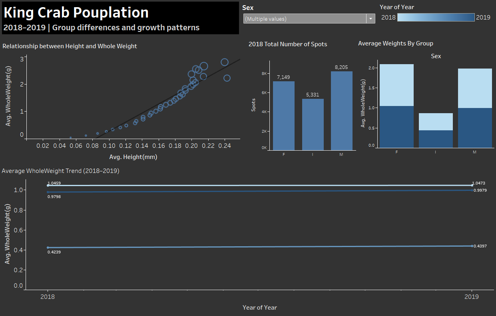

---

## Looker Studio

  
<strong>Sales Dashboard</strong>

**What this dashboard demonstrates**
- KPI-first reporting layout for quick executive scanning
- Model/category comparisons and performance ranking
- Trend tracking to spot growth/decline periods

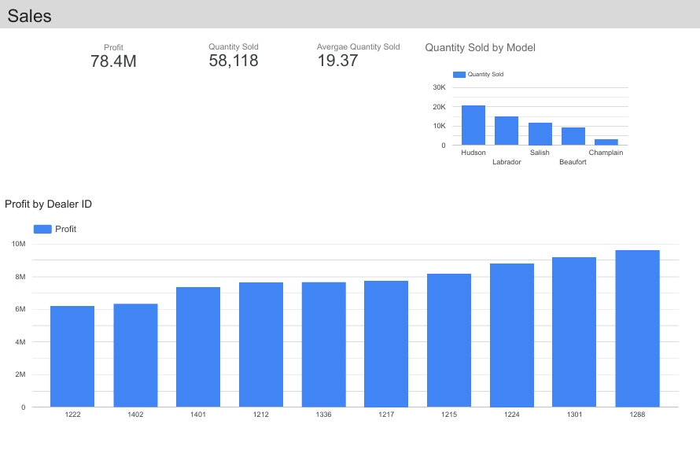

  
<strong>Service Dashboard</strong>

**What this dashboard demonstrates**
- Service/after-sales monitoring structure
- Issue/recall-style reporting layouts
- Customer feedback overview (sentiment summary patterns)

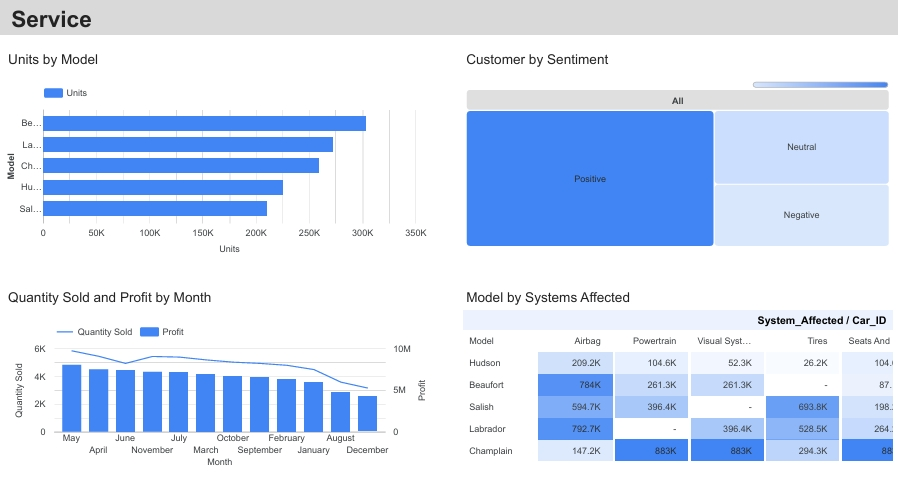

  
<strong>Quantity Sold vs Revenue</strong>

**What this dashboard demonstrates**
- Relationship view between volume and financial performance
- Quick comparison format useful for product-line or category reporting

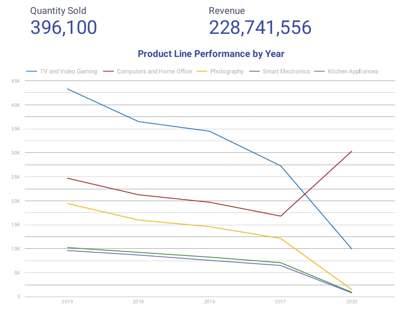

---

## IBM Cognos Analytics

  
<strong>Product Sales Dashboard</strong>

**What this dashboard demonstrates**
- KPI headline totals for fast reporting (quantity / revenue-style summary)
- Product-line performance trends over time
- Multi-series trend comparison for category-level storytelling

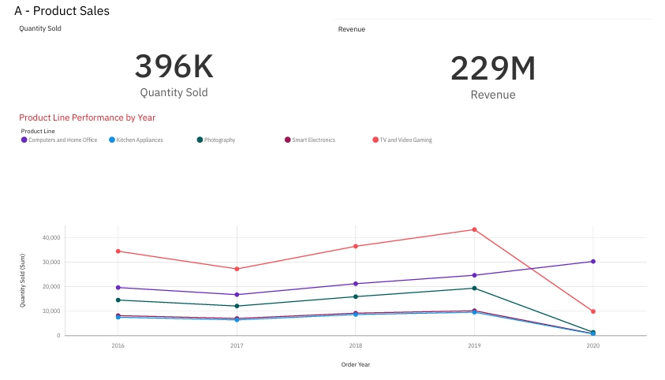

  
<strong>Automotive Sales Dashboard — Quantity Sold &amp; Profit</strong>

**What this dashboard demonstrates**
- High-level sales performance: **profit**, **quantity sold**, and **average quantity**
- Category breakdowns (e.g., quantity by model)
- Clean reporting layout prioritising readability and quick insights

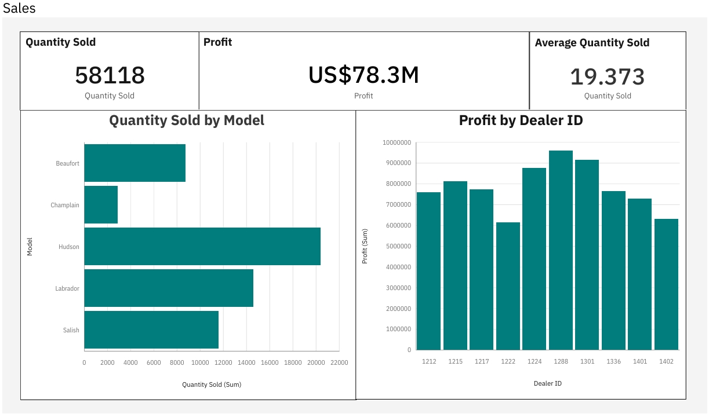

  
<strong>Automotive Sales Dashboard — Dealer ID View</strong>

**What this dashboard demonstrates**
- Dealer-level contribution analysis (which dealers drive performance)
- Comparative bar chart view designed for ranking and variance checking

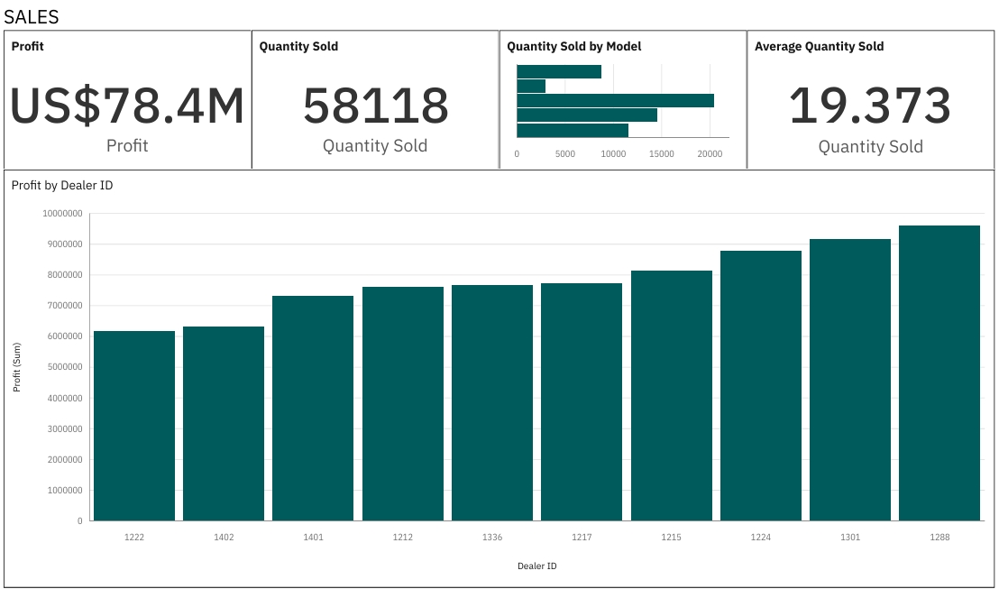

  
<strong>Automotive Service Dashboard</strong>

**What this dashboard demonstrates**
- Service quality monitoring style dashboarding
- Recall / systems-affected mapping for operational insight
- Customer sentiment split visualisation (positive/neutral/negative patterns)

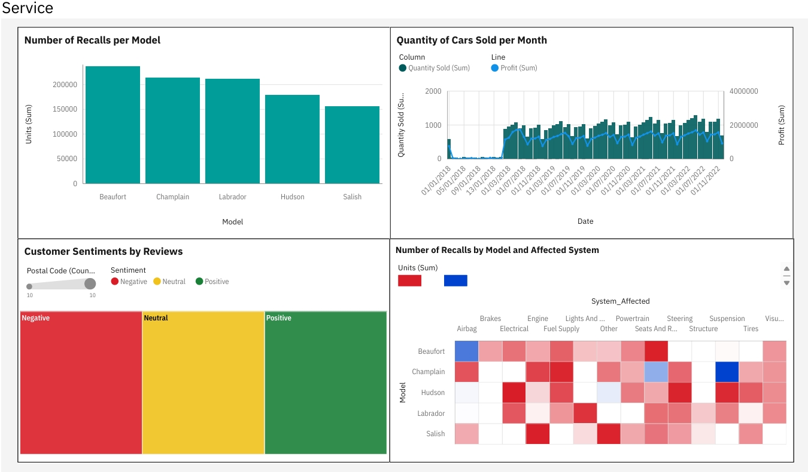

---

## Excel Dashboards

  
<strong>Car Model Sales Dashboard</strong>

**What this dashboard demonstrates**
- Excel-style KPI tiles and clean dashboard layout
- Category comparison (car model performance) for fast interpretation

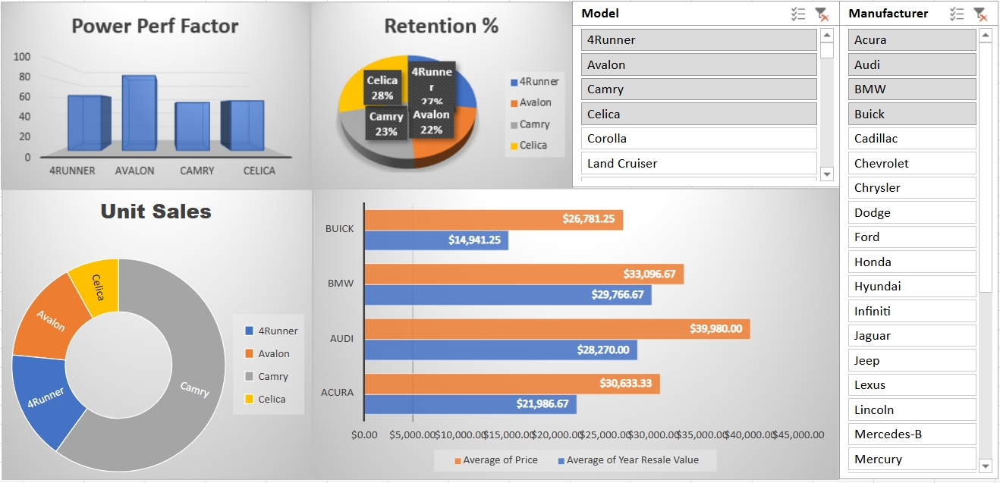

  
<strong>Profit by Date &amp; Model</strong>

**What this dashboard demonstrates**
- Time-based profit tracking with model segmentation
- Useful for identifying growth periods, dips, and performance leaders over time

  
<strong>Profit by Year</strong>

**What this dashboard demonstrates**
- Year-level trend reporting
- Suitable for annual performance summaries and strategic comparison

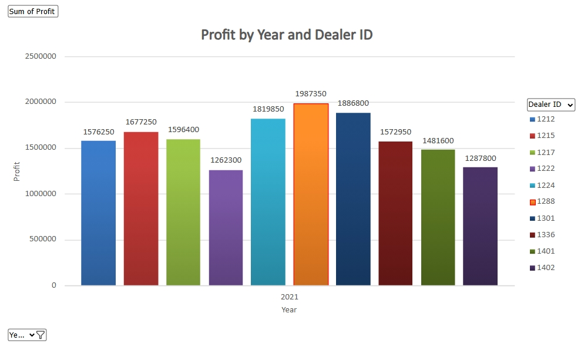

  
<strong>Quantity Sold by Dealer ID</strong>

**What this dashboard demonstrates**
- Dealer-level volume contribution
- Quick ranking view for performance monitoring

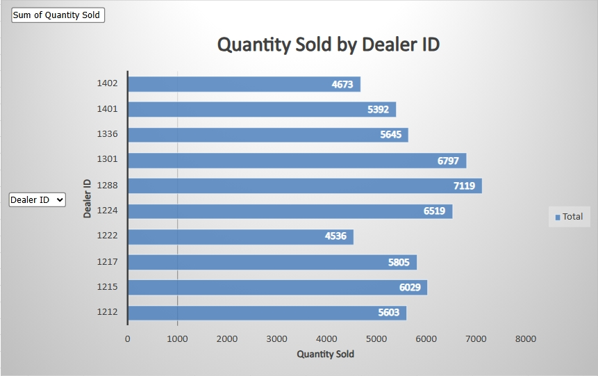

  
<strong>Hudson Model Profit by Dealer ID</strong>

**What this dashboard demonstrates**
- Deep-dive segmentation (single model focus)
- Dealer-level profitability comparison to identify strongest channels

---

## Notes
- All visuals are included as **exported dashboard images** for quick viewing.
- Each tool folder is intended to contain supporting documentation (assumptions, metrics, layout logic, and interpretation guidance).
- Filenames are preserved exactly to keep traceability between exported visuals and their source dashboards.
